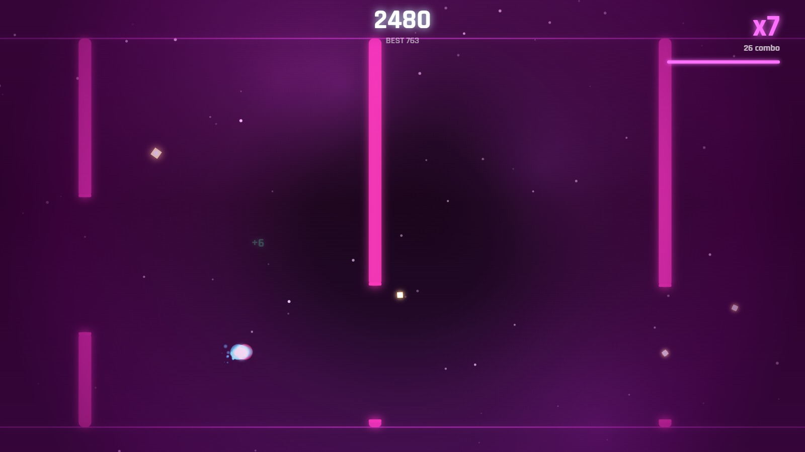

# ⚡ LUMEN

### *flip · thread · flow*

A one-thumb neon arcade game. You are a spark of light falling through a dark
corridor. **Tap to flip gravity.** Thread the gaps, chain the glowing motes into
a combo, and tip into **flow state** — a slow-motion, colour-drenched groove
where the whole world bends to your rhythm.

Easy to learn in three seconds. A skill ceiling you'll chase for weeks.

> **Runs in any browser. Desktop + mobile. Zero dependencies. No install.**



---

## ▶ Play it

### **[kaanipek.github.io/lumen](https://kaanipek.github.io/lumen/)**

Nothing to install. On a phone, use "Add to Home Screen" and it plays with the
network off — the whole game is 600 kB before music, and the service worker
keeps it.

### Or run it locally

```bash
# any static server works — here are two one-liners
python -m http.server 5178          # then open http://localhost:5178
npx serve .                          # then open the printed URL
```

Or just open `index.html` in a browser (a served URL is recommended so the
webfont, audio, and high-score saving all behave).

**Controls**

| Action | Input |
| --- | --- |
| Flip gravity | **Tap / click** anywhere · **Space** · **↑ / ↓ / W** |
| Fire a held item | **Tap its button** (bottom of the playfield) · **1 / 2 / 3** · *say* "shield" |
| Pause | **Esc** / **P** · pause button |
| Mute | **M** · speaker button |
| Fullscreen | **F** |

---

## Why it works

LUMEN is built on the three pillars every runaway hit shares:

1. **Instant to understand.** One input. One rule. You're playing before you've
   finished reading the word "tap".
2. **Impossible to put down.** One-hit death + a smooth difficulty ramp + a
   high-score that's *always* just barely out of reach = the "one more run"
   loop that made Flappy Bird and 2048 unstoppable.
3. **Feels incredible.** Every action is answered — particles, screen shake,
   chromatic light-split, a trail, a synth blip that rises with your combo, and
   an adaptive soundtrack that adds layers as you heat up. Then **flow state**
   drops the world into slow-mo and turns everything magenta. That moment is the
   hook people screenshot and share.

The **flow / combo system** is the twist that separates LUMEN from the flip-a-
gravity crowd: it rewards *greed*. You don't just survive — you dive for motes,
build a multiplier, and gamble your run for the bullet-time high. Risk creates
stories. Stories create shares.

---

## Features

- 🎮 **One-thumb gravity-flip gameplay** — pure skill, no clutter
- 🌊 **Flow state** — chain 16 motes to trigger slow-motion bullet-time
- 🔥 **Combo multiplier** (up to ×12) with a decaying timer that keeps you greedy
- 🎯 **Near-miss rewards** — thread a gate tight for a "CLOSE!" bonus
- 🧱 **Gate variety** — static, vertically-moving, breathing (pulsing), and
  twin double-gaps, phased in as difficulty ramps
- 🎨 **Reactive neon art** — deep-space palette that ignites magenta in flow,
  particle bursts, light trails, chromatic aberration, screen shake
- 🎵 **Adaptive audio** — every sound effect, and the layers that thicken as you
  heat up, are generated live in the Web Audio API. Each of the six worlds also
  has its own recorded theme, made locally with Stable Audio 3 and fetched
  lazily, so the first screen never waits on it — and if one never arrives the
  live sequencer covers for it. *Powered by Stability AI*
- ✦ **Cosmetics shop** — **34 orb skins**, **20 trail styles**, **19 worlds**,
  and **15 signatures**: what your flip, your flow and your death look like.
  **11 sets** buy a whole look at once and never charge for a piece you own.
  Everything cosmetic; nothing sold here touches the difficulty. Every one has a
  **flavour line** with its own dry sense of humour, and the shop previews
  **animate** — trails stream, beat and ripple the way they really do, and
  colour-cycling skins actually cycle instead of sitting there as a flat swatch.
- 🎮 **Seven game modes**, each testing a different part of the same skill —
  **Classic** (the baseline everything is measured against), **Vortex** (the world
  leans and turns as you fly), **Mirror** (everything runs the other way),
  **Sprint** (full speed from the first frame), **Blackout** (light arrives in
  pulses; between them you fly on memory), **Precision** (slow, with gaps barely
  wider than you are) and **Zen** (nothing can kill you — and nothing is
  recorded). Each keeps **its own record**, because a Sprint score and a Precision
  score answer different questions. Harder modes pay more shards; Zen pays none,
  since a mode with no failure state would otherwise be an infinite faucet. The
  Daily Challenge and the tutorial are always Classic.
- 🛒 **One shop, four tabs** — Customize (sets, orbs, trails, signatures), Maps,
  Items and Skills
  all live behind a single SHOP button, each with a one-time explainer the first
  time you open it
- 🎬 **The menu plays itself** — a live attract demo runs behind the main menu so
  the first thing you see is the actual game. It keeps no score, banks no shards
  and counts no runs; tap anywhere and it hands over to a real one
- 🏆 **Leaderboard** — your own best runs offline, plus daily and all-time online
  boards when a server is configured
- 💰 **Two currencies, one honest deal** — every skin and trail can be earned with
  **shards** or bought outright. Shard prices are deliberately steep (the cheapest
  is a few hundred runs' worth of play, the elite tier ~9,000) while cash prices
  stay small and flat — the premium tier is *far* dearer in shards but only a
  little dearer in money. **Maps are shard-only.** Real money is wired through a
  provider seam (`js/iap.js`). The money path is fully built — prices, checkout,
  cancel, grant, restore — running on a **sandbox provider that never charges**,
  because a real processor needs server-side keys that cannot live in a client
  bundle. Every price and the checkout itself say "SANDBOX" out loud. Swap in
  Stripe / Play Billing / StoreKit with one call:
  `LUMEN.IAP.register(yourProvider)`
- 🏅 **Achievement-exclusive skins** — *Aurora*, *Obsidian*, *Phoenix* and *Zenith*
  cannot be bought at any price. They only unlock by earning the achievement,
  and the shop says so instead of showing a button
- 🎯 **Missions** — three rotating goals that pay shards and refresh as you clear them
- ◈ **Daily Challenge** — a *deterministically planned* seeded run (identical course
  for everyone that day, on any screen size) with its own best score and a **streak**
- 🏆 **Local leaderboard** — your ten best runs, with combo and date
- ❤️ **Revive** — spend shards once per run to continue, with a grace shield
- 📈 **Procedural difficulty** — fair, readable ramp from a gentle open to
  moving gates and razor gaps
- 📱 **Made for phones** — responsive portrait/landscape, touch, haptics,
  safe-area aware, installable as a PWA (offline via service worker)
- 🎓 **Guided tutorial** — five un-losable lessons (flip → thread → motes → chain
  → flow). Crashing coaches you instead of ending the run; new players get it
  automatically, and it never touches your scores
- ⚡ **Power-ups go to your hand, not off instantly** — pick up **Magnet**,
  **Shield** or **Slow-mo** and it waits until *you* fire it, from an on-screen
  button, the number keys, or your voice. Prefer the old behaviour? One toggle in
  Settings puts auto-use back. Seeded, so the daily stays fair
- 🎤 **Voice control** — say the item: *"shield"*, *"magnet"*, *"slow"*, and it
  fires. Works in all four languages, opt-in, and asks for the microphone **once**
  — it keeps a single recogniser and a single stream open for the page, so pausing,
  resuming or switching tabs never re-prompts. A live dot shows when it's
  listening, and it tells you when your hand is empty instead of doing nothing.
  Nothing is recorded or transmitted — the browser hands back text, we match a
  keyword and drop it
- 🎒 **Six consumables**, each answering a different way to lose: **Shield**
  (undo one crash), **Magnet** (reach what you couldn't), **Slow** (buy reaction
  time), **Scout** (see the line through the next gates), **Anchor** (half
  gravity, flatter arcs) and **Spark** (hands back the chain you just lost).
  Capped at **one of each and three in total** so they're a decision, never a
  crutch. Barred from the Daily Challenge entirely
- 🏆 **26 achievements** across five categories, each paying shards, several
  handing over an exclusive skin — with a progress page that shows exactly how
  far off you are
- 🧠 **Skills** — five upgrade lines (magnet reach, flow threshold, combo
  duration, near-miss window, revive cost), sold in the shop alongside everything
  else. **Disabled in the Daily Challenge**, so the shared course stays a pure
  test of hands
- 🎚 **Difficulty** — Easy / Normal / Hard, scaling gap size, reaction time and
  spawn rate, with the score multiplier adjusted to match. The daily is always
  Normal for everyone
- 🌍 **Four languages** — English, Türkçe, Español, 中文 — fully localised
  (menus, missions, shop, achievements, settings, tutorial), auto-detected from
  the browser and switchable in-game
- ♿ **Accessibility** — colour-vision presets (deuteranopia / protanopia /
  tritanopia), high contrast, reduce-flashing, honours `prefers-reduced-motion`,
  pinch-zoom allowed, and an ARIA live region so screen readers get the score
- 🎮 **Gamepad support** — any face button or d-pad flips; Start pauses
- 📤 **Share an image**, not a sentence — the run is composited into a 1200×630
  card and handed to the native share sheet
- 🏆 **Online leaderboard (optional)** — daily + all-time, with a real
  dependency-free reference server in [`server/`](server/README.md)
- 🔒 **Privacy-first telemetry** — anonymous, opt-**in**, no personal data, and a
  written [privacy policy](privacy.html). The web and desktop builds carry no ad
  SDK at all; the mobile app adds the Google Mobile Ads SDK for **rewarded video
  only** — no banners, no interstitials, and no ad that plays on its own
- 🖥 **Fullscreen** (button or **F**), with graphics tiers — **Auto / High /
  Med / Low** — that also self-adjust if frames start dropping
- ⚙️ **Settings** — grouped into Audio / Gameplay / Accessibility / Display:
  Music and SFX independently, auto-use power-ups, voice control, haptics,
  difficulty, reduce-flashing, high contrast, colour-vision preset, language,
  graphics tier, telemetry consent, and reset-progress
- 💾 **Local high scores** — best score, best combo, run stats, all offline
- 📤 **One-tap share** your score
- ♿ **Respects `prefers-reduced-motion`**, colour-language keeps hero /
  reward (gold) / danger (magenta) always distinct — whatever skin you equip

---

## Tech

- **Vanilla JavaScript + Canvas 2D.** No framework, no build step, no packages.
- **Web Audio API** for every sound effect and for the adaptive layers that
  come and go with your combo — all synthesised at runtime, no samples.
- **Six world themes** generated locally with Stable Audio 3, fetched lazily so
  the first screen never waits on them. A world with no track, or one that
  fails to load, falls back to the live sequencer and still plays.
  *Powered by Stability AI* — see [NOTICE](NOTICE).
- Four small files of game code + one stylesheet. The entire game is a few
  tens of KB of text. It loads instantly and runs on a potato.

```
Lumen/
├── index.html          # shell + DOM overlays (menu / game-over / pause)
├── css/style.css       # neon UI
├── js/
│   ├── audio.js        # synthesised SFX + adaptive music sequencer
│   ├── game.js         # gameplay, physics, particles, rendering, HUD
│   ├── cosmetics.js    # dual-currency catalog: skins / trails / maps
│   ├── progression.js  # achievements, skills, carryable consumables
│   ├── iap.js          # real-money provider seam (no SDK ships)
│   ├── voice.js        # one-word speech commands
│   ├── cheats.js       # dev-only cheats (inert on a public origin)
│   ├── modes.js        # the ten game modes
│   ├── missions.js     # rotating missions + daily challenge logic
│   ├── scores.js       # local top-10 leaderboard
│   ├── leaderboard.js  # optional online board client
│   ├── analytics.js    # opt-in telemetry, consent, rewards seam
│   ├── i18n.js         # English / Türkçe / Español / 中文
│   ├── input.js        # gamepad + share-image card
│   ├── ui.js           # menus, shop tabs, checkout, leaderboard, settings
│   └── main.js         # bootstrap + game loop
├── manifest.json       # PWA manifest
├── sw.js               # service worker (offline)
├── tests/              # automated test suite (open tests/index.html)
├── tools/              # bump-version.js (run before deploying)
├── server/             # optional leaderboard reference server
├── privacy.html        # privacy policy
├── assets/             # screenshots + generated app icons
├── landing/            # marketing landing page
└── docs/               # design doc + press kit
```

## Developer cheats

Only active when the page is served from somewhere a player can't be — `localhost`,
a private LAN address, or `file://`. On a real domain `js/cheats.js` is inert:
`LUMEN.cheat` is never even defined, and the gate is the origin itself, so there's
no flag or key sequence that opens it in a shipped build.

**Any run that uses a cheat is discarded whole** — no score, no best, no shards,
no missions, no achievements, no lifetime stats, nothing submitted to the online
board. A gold `DEV RUN — NOT COUNTED` badge sits on the canvas the whole time, so
a cheated frame can't be mistaken for a real one in a screenshot.

```js
LUMEN.cheat.help()          // list everything
LUMEN.cheat.god()           // toggle invulnerability
LUMEN.cheat.shards(5000)    // add shards
LUMEN.cheat.unlockAll()     // own every skin, trail and map
LUMEN.cheat.items()         // fill your hand with consumables
LUMEN.cheat.skip(60)        // jump the difficulty ramp forward 60s
LUMEN.cheat.score(10000)    // set the running score
LUMEN.cheat.combo(20)       // set the combo
LUMEN.cheat.flow()          // arm flow state
LUMEN.cheat.freeze()        // stop the world, to study a gate
LUMEN.cheat.clearGates()    // clear the screen
LUMEN.cheat.achievements()  // grant them all, to see the finished page
LUMEN.cheat.wipe()          // reset the save file
```

With no console to hand, typing `idkfa` in-game toggles god mode and `idclip`
toggles freeze.

---

## Shipping

Steam and mobile builds live in  and , both thin shells around
these same files. See **[docs/SHIPPING.md](docs/SHIPPING.md)** for what is built,
what still needs your accounts, and the exact store-asset sizes.

---

## Tests

LUMEN ships with a self-contained suite covering the economy, missions, daily
determinism, leaderboard, collision, physics, revive, rendering, resize and audio:

```bash
python -m http.server 5178
```

Then open `http://localhost:5178/tests/` — 118 tests, green means shippable.
Results are also on `window.__RESULTS` if you want to wire it into CI.

**Before deploying**, stamp the assets so returning players can't end up running a
mix of old and new files:

```bash
node tools/bump-version.js
```

**Notable invariants it locks down**
- every generated gap — including a moving gate at full travel — stays inside the
  playfield, so an unavoidable death is impossible
- **no collectable is ever placed inside a wall** — swept across 12 viewports ×
  3 difficulties, because the failure was resolution-dependent and one screen
  size would have missed it
- a daily challenge plans an identical course for every player, on any screen —
  and ignores every skill, item and difficulty setting
- achievement-only cosmetics have no price and cannot be bought at any balance
- carried items are capped at one of each and three in total
- shards can't be duplicated, lost, or spent twice; a run finalises exactly once

---

## Shipping it

LUMEN is a static site — deploy it anywhere:

- **itch.io** — zip the folder, upload as an HTML5 game, tick "play in browser".
- **Web / PWA** — drop it on any static host (Netlify, GitHub Pages, Cloudflare
  Pages, a plain bucket). `manifest.json` makes it installable to a home screen.
- **App stores** — wrap with Capacitor / a WebView shell for Google Play & the
  App Store. Because there are zero native dependencies, the wrap is trivial.

See [`docs/GAME_DESIGN.md`](docs/GAME_DESIGN.md) for the full design rationale,
progression maths, and the retention/monetisation playbook, and
[`docs/PRESS_KIT.md`](docs/PRESS_KIT.md) for store copy and fact sheet.

---

*Built as a complete, shippable vertical slice — design, code, art direction,
and sound in one pass.*
